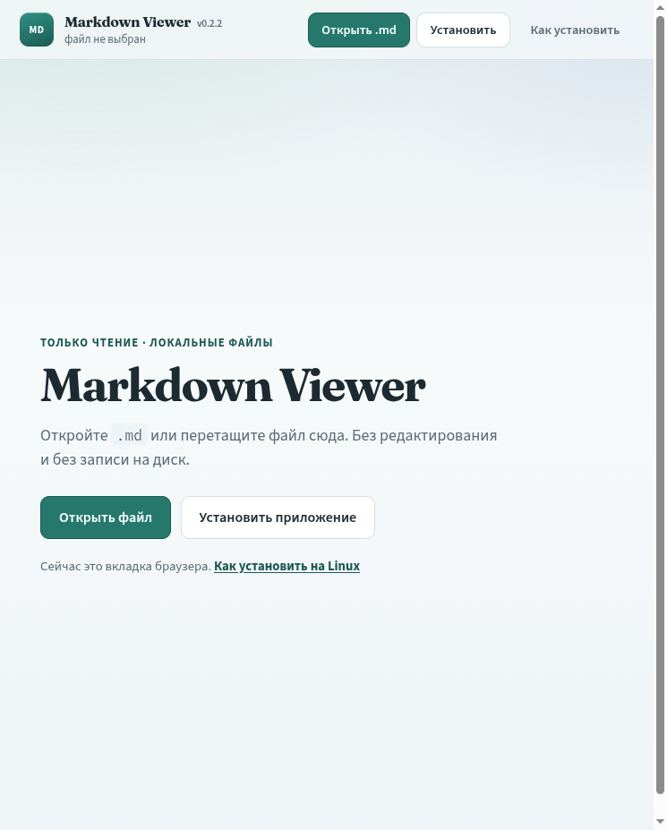
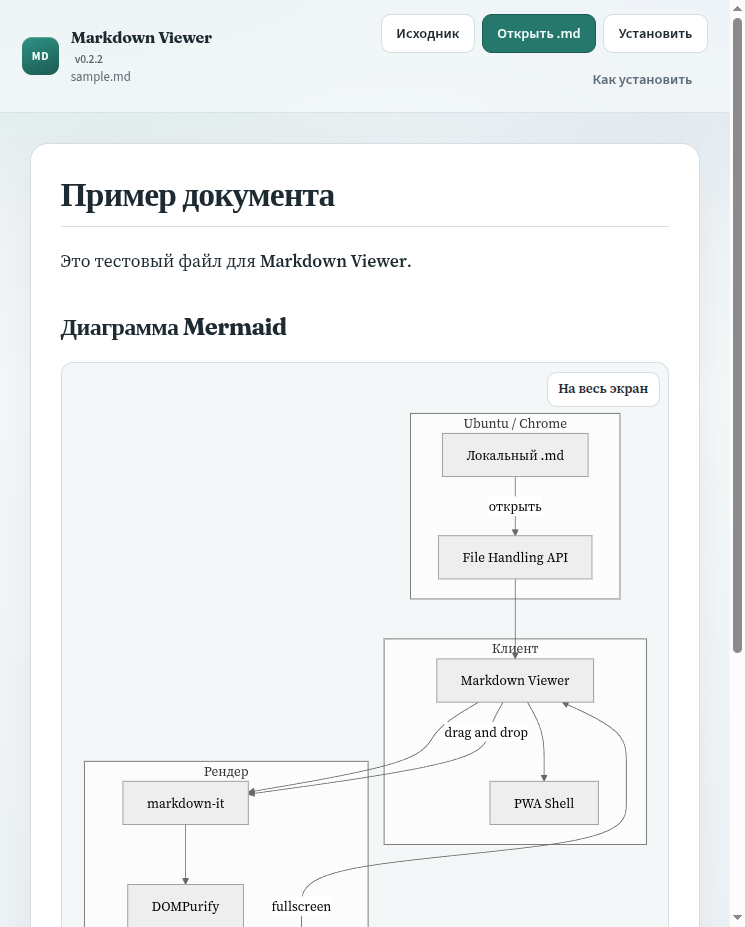
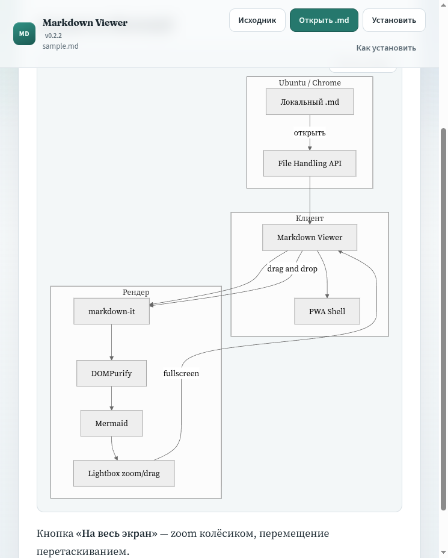
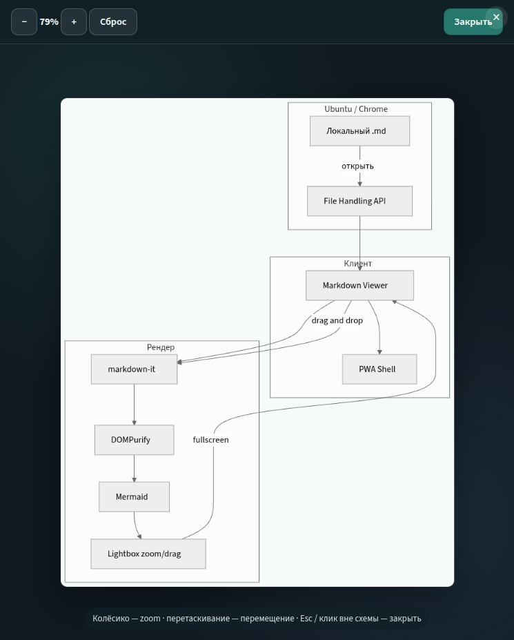

# Markdown Viewer

PWA для просмотра локальных `.md` файлов (только чтение). Стек: **Vue 3** (Composition API) + Vite + Vitest.

## Ссылки

- Репозиторий: https://github.com/antirek/markdown-viewer
- Приложение (GitHub Pages): https://antirek.github.io/markdown-viewer/

## Скриншоты

| | |
|:---:|:---:|
|  |  |
| Стартовый экран | Открытый `.md` |
|  |  |
| Диаграмма Mermaid в документе | Полноэкранный просмотр (zoom / pan) |

## Локальный запуск

```bash
npm install
npm run dev
```

Откройте URL из терминала в **Chrome / Chromium**. Для проверки установки PWA нужен HTTPS или `localhost`.

Сборка и тесты:

```bash
npm run build
npm run preview
npm test
```

## Деплой на GitHub Pages

Уже настроен workflow `.github/workflows/deploy-pages.yml`.

1. В репозитории: **Settings → Pages → Build and deployment → Source: GitHub Actions**.
2. Запушьте `main` (или вручную запустите workflow **Deploy GitHub Pages**).
3. Через 1–2 минуты сайт будет на https://antirek.github.io/markdown-viewer/

## Возможности MVP

- Рендер Markdown (markdown-it) + санитизация (DOMPurify)
- Диаграммы Mermaid в блоках ` ```mermaid ` (полноэкранный просмотр с zoom/drag)
- Drag-and-drop и кнопка «Открыть .md»
- PWA: установка как приложение
- `file_handlers` + `launchQueue` — открытие `.md` из ОС (Chromium)
- Инструкция установки по ОС (Windows / macOS / Linux)

## Проверка открытия из ОС

1. Откройте Pages-URL в Chrome и установите приложение.
2. ПКМ по `.md` → «Открыть с помощью» → Markdown Viewer.
