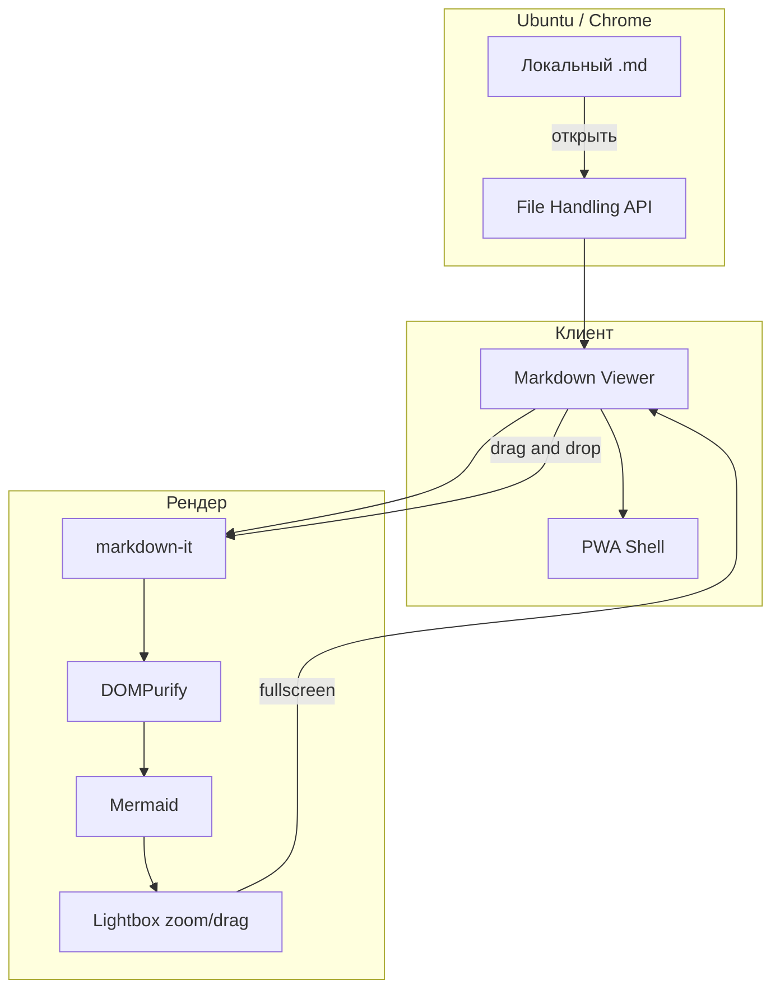
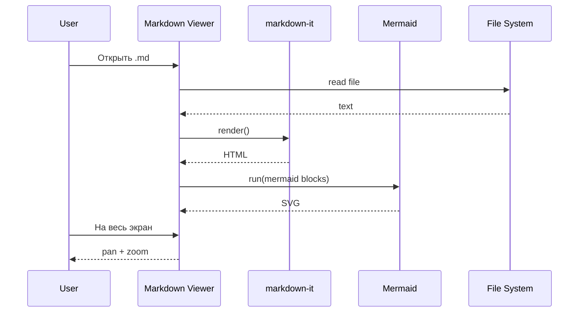

# Сложная схема Mermaid

Проверка полноэкранного режима.

```mermaid
flowchart TB
  subgraph Client["Клиент"]
    UI[Markdown Viewer]
    PWA[PWA Shell]
  end

  subgraph Render["Рендер"]
    MD[markdown-it]
    SAN[DOMPurify]
    MM[Mermaid]
    LB[Lightbox zoom/drag]
  end

  subgraph OS["Ubuntu / Chrome"]
    FS[Локальный .md]
    FH[File Handling API]
  end

  FS -->|открыть| FH
  FH --> UI
  UI --> PWA
  UI --> MD
  MD --> SAN
  SAN --> MM
  MM --> LB

  UI -->|drag and drop| MD
  LB -->|fullscreen| UI
```

```mermaid
sequenceDiagram
  participant User
  participant App as Markdown Viewer
  participant MD as markdown-it
  participant MM as Mermaid
  participant FS as File System

  User->>App: Открыть .md
  App->>FS: read file
  FS-->>App: text
  App->>MD: render()
  MD-->>App: HTML
  App->>MM: run(mermaid blocks)
  MM-->>App: SVG
  User->>App: На весь экран
  App-->>User: pan + zoom
```
