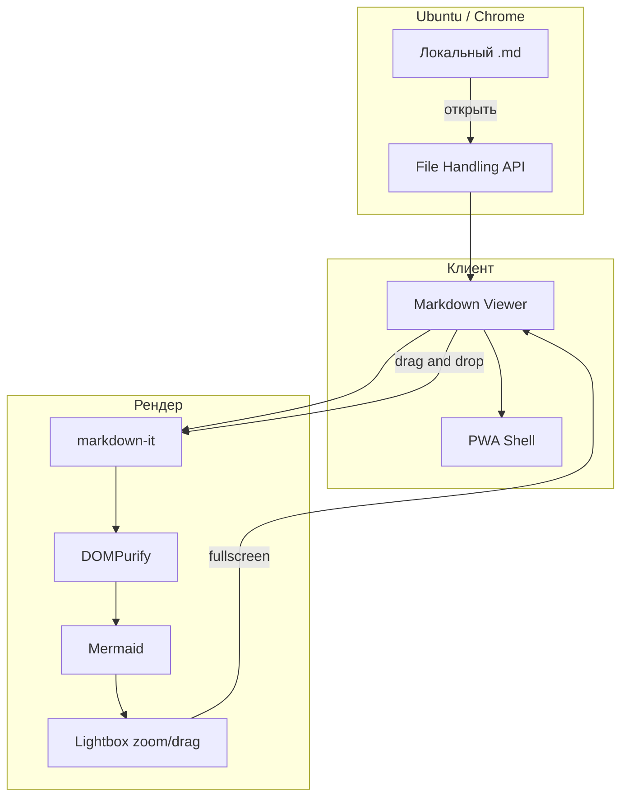

# Пример документа

Это тестовый файл для **Markdown Viewer**.

## Диаграмма Mermaid

```mermaid
flowchart TB
  subgraph Client["Клиент"]
    UI[Markdown Viewer]
    PWA[PWA Shell]
  end

  subgraph Render["Рендер"]
    MD[markdown-it]
    SAN[DOMPurify]
    MM[Mermaid]
    LB[Lightbox zoom/drag]
  end

  subgraph OS["Ubuntu / Chrome"]
    FS[Локальный .md]
    FH[File Handling API]
  end

  FS -->|открыть| FH
  FH --> UI
  UI --> PWA
  UI --> MD
  MD --> SAN
  SAN --> MM
  MM --> LB
  UI -->|drag and drop| MD
  LB -->|fullscreen| UI
```

Кнопка **«На весь экран»** — zoom колёсиком, перемещение перетаскиванием.
